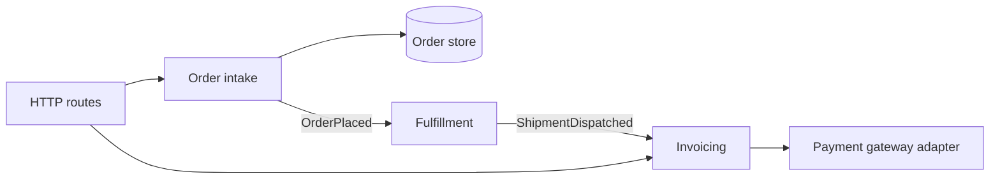
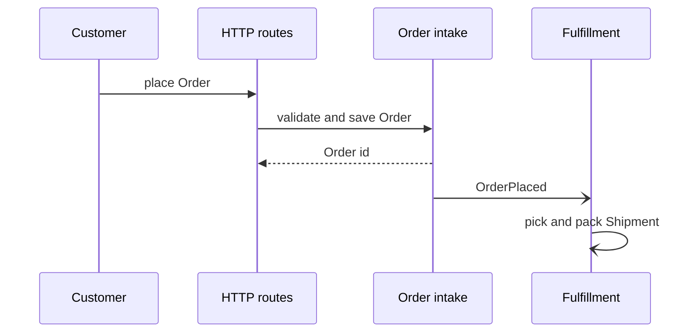
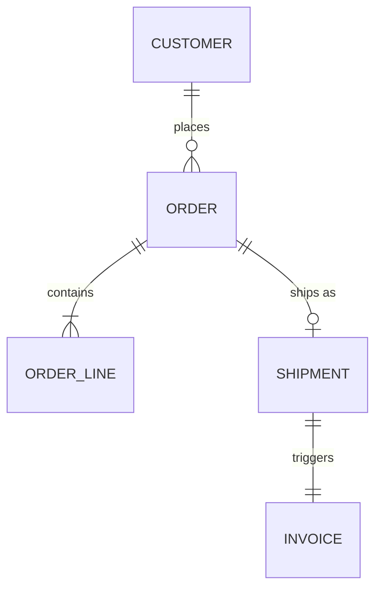
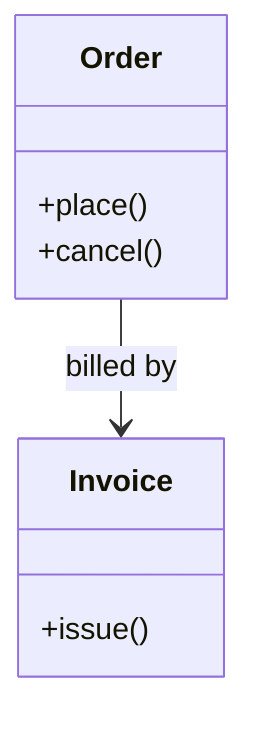

# Diagram examples

Glossary assumed: **Order**, **Customer**, **Invoice**, **Shipment**; Ordering and Billing are contexts. Labels use those terms; node ids stay short.

## Modules and dependencies

## Main flow

## Core data

Use classDiagram instead when behaviour on the types matters more than cardinality:

