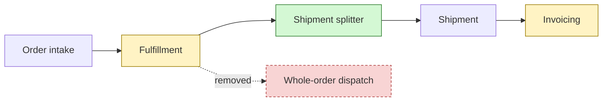

# Worked example

Glossary: **Order** (_Avoid_: purchase), **Order line**, **Shipment**, **Invoice** (_Avoid_: bill).

Branch feature/partial-ship against main, 3 commits, 6 files.

**Why**: lets one Order ship in several Shipments so stock that is ready does not wait on stock that is not.



```diff
 type Shipment = {
   id: ShipmentId
   orderId: OrderId
+  lines: OrderLineId[]
   dispatchedAt?: Date
 }
```

```diff
 events
-  OrderShipped { orderId }
+  ShipmentDispatched { orderId, shipmentId, lines }
```

**Naming check**

| Name | Domain term | Verdict |
|---|---|---|
| ShipmentSplitter | Shipment | ok |
| ShipmentDispatched | Shipment | ok |
| billPartial | Invoice | synonym of Invoice (bill is under _Avoid_) |
| PartialFulfilment | none | term missing from glossary |
| lineData | Order line | vague |

**Suggestions**

- billPartial could be invoiceShipment.
- lineData could be shipmentLines.
- Partial fulfilment is a new concept; run domain-modeling to define it (and decide between it and Split shipment).
